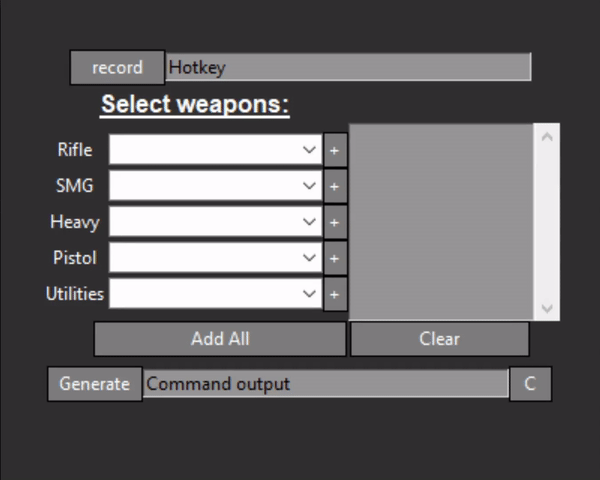
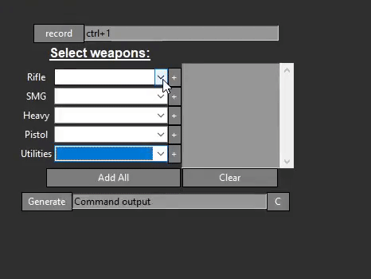
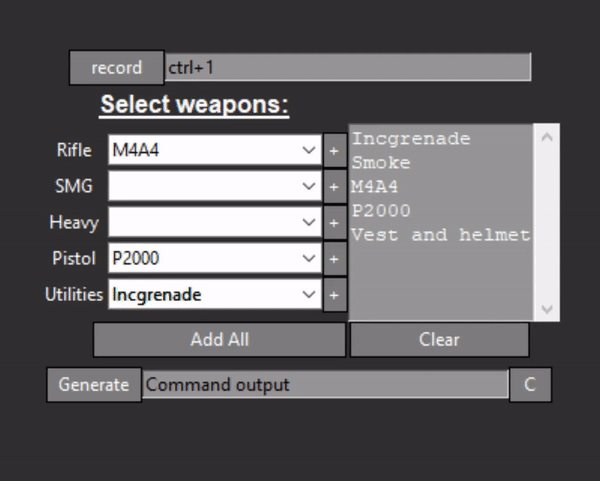

# DOWNLOAD  

[0.2.1](https://github.com/silas-hw/csgo-autobuy/raw/0.2.1/installer.exe)  
[0.2](https://github.com/silas-hw/csgo-autobuy/raw/0.2/installer.exe)  
[0.1.1](https://github.com/silas-hw/csgo-autobuy/raw/0.1.1/csgo-autobuy.exe)  

## What does it do?  

csgo-autobuy generates a copy and pasteable csgo buy command  

## How do I use it?  

1. Record the hotkey to bind the buy to  

  

2. Select what weapons you want the bind to buy  

  

3. Generate the command and copy it to paste into csgo console  

  
